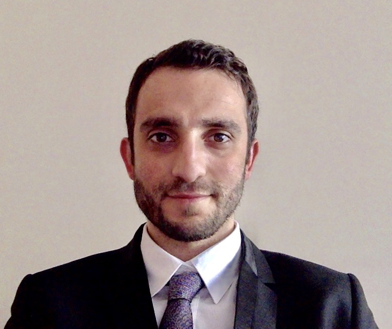
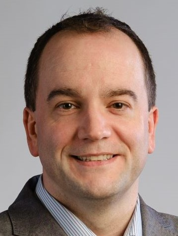

---
hide:
    - footer
    - title
---

<!-- Xingyu Zhao, Simos Gerasimou, Radu Calinescu, Calum Imrie, Valentin Robu, and David Flynn -->

<table>
    <tr>
        <td style="min-width: 100px" id="photo-container">
            
        </td>
        <td>        
            <h1 style="margin-bottom:20px">
                <a href="https://www.xzhao.me" target="_blank">
                    Xingyu Zhao
                </a>
            </h1>
            <h3>
                Assistant Professor  Department of Computer Science, University of Liverpool, Liverpool, UK
            </h3>
        </td>
    </tr>
    <tr><tr/>
    <tr>
        <td style="min-width: 100px" id="photo-container">
            
        </td>
        <td>        
            <h1 style="margin-bottom:20px">
                <a href="https://www-users.cs.york.ac.uk/simos" target="_blank">
                    Simos Gerasimou
                </a>
            </h1>
            <h3>
                Assistant Professor  Department of Computer Science, University of York, York, UK
            </h3>
        </td>
    </tr>
    <tr>
        <td style="min-width: 100px" id="photo-container">
            
        </td>
        <td>        
            <h1 style="margin-bottom:20px">
                <a href="https://www-users.cs.york.ac.uk/raduc" target="_blank">
                    Radu Calinescu
                </a>
            </h1>
            <h3>
                Professor  Department of Computer Science, University of York, York, UK
            </h3>
        </td>
    </tr>
    <tr>
        <td style="min-width: 100px" id="photo-container">
            
        <td>        
            <h1 style="margin-bottom:20px">
                <a href="https://www.cs.york.ac.uk/people/?group=All%20Staff&username=cimrie" target="_blank">
                    Calum Imrie
                </a>
            </h1>
            <h3>
                Research Associate  Department of Computer Science, University of York, York, UK
            </h3>
        </td>
    </tr>
    <tr>
        <td style="min-width: 100px" id="photo-container">
            
        </td>
        <td>        
            <h1 style="margin-bottom:20px">
                <a href="https://homepages.cwi.nl/~robu" target="_blank">
                    Valentin Robu
                </a>
            </h1>
            <h3>
                Associate Professor   Intelligent and Autonomous Systems, Group, Centrum Wiskunde & Informatica, NL
            </h3>
        </td>
    </tr>
    <tr>
        <td style="min-width: 100px" id="photo-container">
            
        </td>
        <td>        
            <h1 style="margin-bottom:20px">
                <a href="https://www.gla.ac.uk/schools/engineering/staff/davidflynn" target="_blank">
                    David Flynn
                </a>
            </h1>
            <h3>
            Professor  School of Engineering, University of Glasgow, Glasgow, UK 
           </h3>
        </td>
    </tr>
</table>