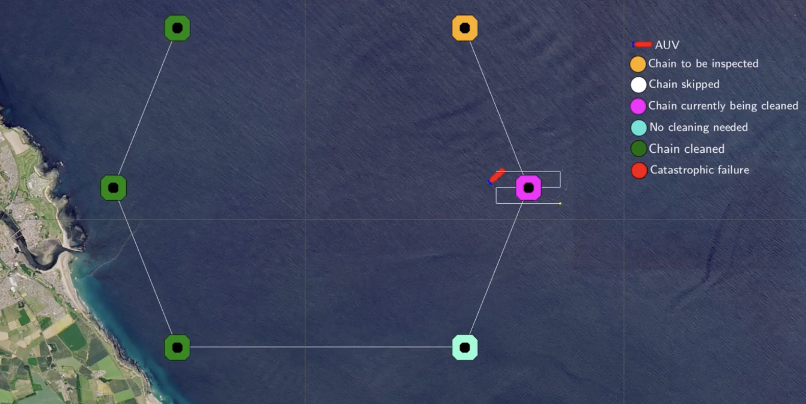
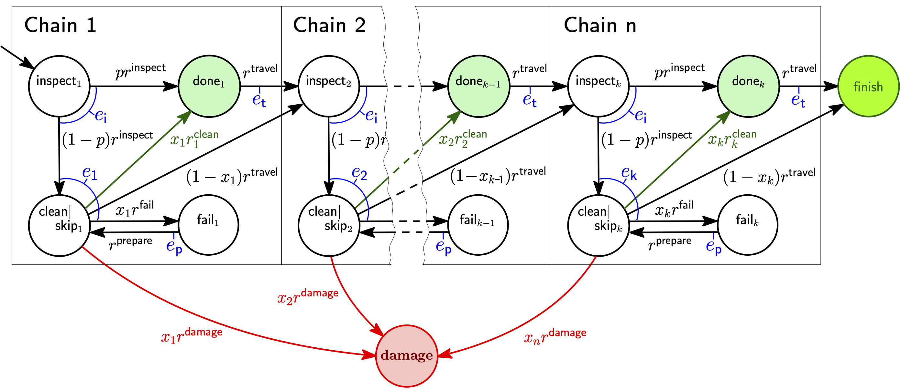

---
hide:
    - footer
    - title
---

### **Offshore infrastructure maintenance**

An autonomous underwater vehicle (AUV) is deployed to execute a structural health inspection and cleaning mission of the substructure of an offshore wind farm. 

The offshore wind farm comprises multiple floating wind turbines, with each turbine being a buoyant foundation structure secured to the sea bed with floating chains tethered to anchors weighing several tons.  Wind farms with floating wind turbines offer increased wind exploitation, reduced installation costs, and reduced impact on the visual and maritime life[^1]. 

The AUV is deployed to collect data about the condition of $k \geq 1$ floating chains to enable the post-mission identification of problems that could affect the structural integrity of the chain. When the visual inspection of a chain is hindered due to accumulated biofouling, the AUV can use its on-board high-pressure water jet to clean the chain and continue with the inspection[^2]. 
 
 The high degrees of _aleatoric uncertainty_ in navigation and the perception of the marine environment entail that the AUV might fail to clean a chain. When this occurs, the AUV can retry the cleaning task or skip the chain and move to the next.

<figure markdown>
  
  <figcaption>Illustration of the AUV executing the floating chain cleaning and inspection mission</figcaption>
</figure>

### **Stochastic mission modelling**

<figure markdown>
  
  <figcaption>CTMC of the floating chain cleaning and inspection mission</figcaption>
</figure>

The figure above shows the parametric CTMC model of the floating chain inspection and cleaning mission. 
The AUV inspects the $i$-th chain with rate $r^\mathrm{inspect}$ and consumes energy $e_i$. 

The chain is clean with probability $p$ and the AUV travels to the  next chain with rate $r^\mathrm{travel}$ consuming energy $e_t$, or the chain needs cleaning with probability $1-p$.
When the AUV attempts the cleaning ($x_i=1$), the task succeeds with chain-dependent rate $r_i^\mathrm{clean}$, causes catastrophic damage to the floating chain or itself with rate $r^\mathrm{damage}$ or fails with  rate $r^\mathrm{fail}$. 

If the cleaning fails, the AUV prepares to retry with known and fixed rate $r^\mathrm{prepare}$ requiring energy $e_p$; it either retries cleaning ($x_i=1$) or skips the current chain, moving to chain $i\!+\!1$ ($x_i=0$). 
After executing the tasks on the $k$-th chain, the AUV returns to its base  completes the mission. 

When cleaning is needed for the $i$-th chain, the AUV controller synthesises a plan by determining the control parameter $x_i \in \{0,1\}$  for all remaining chains $i, i+1, ...k$ so that the system requirements in the table below are satisfied. 

 <a name="tab:reqs"/>

| ID  | Informal description                         | Formal specification|
| ----| ------------------------------------ | --------------------|
| R1  | The probability of mission failure  must not exceed 5%                                  | $P_{\leq 0.05} [F \textsf{ damage}]$                              |
| R2  | The expected energy consumption must not exceed the remaining energy $E_\mathrm{left}$  | $R^\mathrm{energy}_{\leq E_\mathrm{left}} [F \textsf{ finish}]$   |
| R3  | ubject to R1 and R2 being met, maximise the number of cleaned chains                    | find  _argmax_ $\sum_{i=1}^n x_i$ such that $R1 \land R2$    |

### **Example Scenario**

We demonstrate our solution for robust verification and adaptation using a mission in which the AUV was deployed  to inspect and, if needed, clean six chains placed in a hexagonal arrangement.

<figure markdown>
  
  <figcaption>Infrastructure inspection and cleaning mission using six chains</figcaption>
</figure>

The figure above shows the AUV performing one instance of the mission, with details of the probabilistic model checking carried out during the inspection and cleaning of chain 3.

The middle screenshot from the simulation timeline shows the AUV at the third chain; with four chains remaining, there will be $2^{3}=8$ system configurations to consider, corresponding to $x_3=1$ and $x_4,x_5,x_6\in\{0,1\}$. 
The plots below the mission simulation timeline show the outcome of the model checking carried out by the AUV at this chain. The AUV only succeeded to clean this chain at the third attempt, and the results of the model checking analyses for these attempts are shown in successive columns, with each row depicting the analysis of one of the requirements from the requirements [Table](#tab:reqs).

A system configuration is feasible if it satisfies requirements 

- **R1**: the AUV will not encounter a catastrophic failure with probability of at least 0.95; and 
- **R2**: the energy consumption does not exceed what the AUV has remaining. 

If multiple feasible configurations exist, then the winner is the configuration that maximises the number of chains cleaned (requirement **R3**). If there is still a tie, the configuration is chosen randomly from those that clean the most chains. 

In the AUV first attempt at chain 3, all the configurations are feasible, so configuration 1 (highlighted, and corresponding to the highest number of chains cleaned) is selected. This attempt fails and a second assessment is made. This time, only system configurations 2--8 are feasible, and as configurations 2, 3, and 5 maximise R3, a configuration is chosen randomly from this subset (in this case configuration 3). This attempt also fails, and on the third attempt only configurations 4--8 are feasible, with 5 maximising R3, and the AUV adopts this configuration and succeeds in cleaning the chain.

### **Video**

<!--  -->
<!-- <video width="640" height="480" controls>
  <source src="https://drive.google.com/file/d/1dv6EyhTIH36kcLw5ELdu4flwcn-tJC_s/preview" type="video">
</video> -->
<iframe src="https://drive.google.com/file/d/1dv6EyhTIH36kcLw5ELdu4flwcn-tJC_s/preview" width="720" height="480"
frameborder="0" allow="accelerometer; autoplay; encrypted-media; gyroscope;
picture-in-picture" allowfullscreen="true"></iframe>

[^1]: Anders Myhr, Catho Bjerkseter, Anders Ågotnes, and Tor A Nygaard. Levelised cost of energy for offshore floating wind turbines in a life cycle perspective. Renewable Energy, 66:714–728, 2014.
[^2]: David M Lane, Francesco Maurelli, Petar Kormushev, Marc Carreras, Maria Fox, and Konstantinos Kyriakopoulos. PANDORA-persistent autonomy through learning, adaptation, observation and replanning. IFAC-PapersOnLine, 48(2):238–243, 2015.
