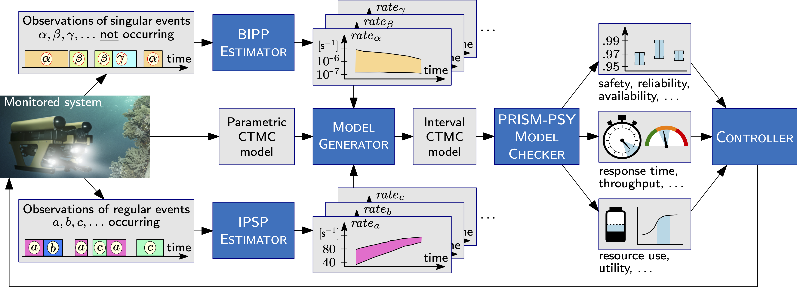

---
hide:
    - footer
    - title
---
# Robust Bayesian Verification 

???+ tip "Summary"
    - [x] A novel **Bayesian learning framework** enabling the runtime verification of autonomous robots performing critical missions in uncertain environments.

    - [x] We consider **regular** (occurring regularly during system operation) and **singular events** occurring zero/once (catastrophic failures, completion of difficult one-off tasks).

    - [x] Our [BIPP Bayesian estimator](estimators.md#bipp-estimator) (using partial priors) uses prior knowledge and the lack of runtime data to learn expected ranges of rates  for singular events

    - [x] Our [IPSP Bayesian estimator](estimators.md#ipsp-estimator) (using imprecise probability with sets of priors) uses prior knowledge and runtime data to learn expected ranges of rates for regural events

    - [x] The learnt rate ranges instrument **interval continuous-time Markov models** 
    
    - [x] Quantitative verification on these models enables computing **expected intervals for key system properties** capturing the parametric uncertainy of the robotic mission

    - [x] The framework is illustrated on a case study for the verification of an **offshore wind-turbine inspection and maintenance robotic mission**
    <!-- **autonomous robotic mission for underwater infrastructure inspection and repair** -->

    <a href="https://drive.google.com/file/d/1dv6EyhTIH36kcLw5ELdu4flwcn-tJC_s/view?usp=share_link" target="_blank">
        :material-video:{ .filledIconsBlue }
     </a>
    <a href="https://github.com/gerasimou/NMI" target="_blank">
        :material-github:{ .filledIconsDarkBlue }
    </a>

<!-- [[Subscribe to our newsletter](#){ .md-button }]() -->

<!-- - [x] You can find a :material-video:{ .filledIconsBlue } showing our work is available -->
<!-- [here](assets/video/nmiVideo.mp4):material-video:{ .filled }  -->

    

<!-- - [x]  Prior knowledge and runtime observations are used to learn expected ranges of rates values for regural and singural events -->
<!-- - catastrophic failures, completion of difficult one-off tasks) -->

<!-- [ ] For **regular events**, we developed a Bayesian inference using imprecise probability with sets of priors (IPSP) estimator -->
<!-- - [ ] For **singular events**, we developed a Bayesian inference using partial priors (BIPP) estimator -->

<!-- [Send :fontawesome-solid-paper-plane:][Demo]{ .md-button } -->

## Framework

<figure markdown>
  
  <figcaption>Robust Bayesian Verification Framework</figcaption>
</figure>

Our end-to-end verification framework supports the online computation of **bounded intervals of CTMC properties**. 
The framework integrates our [BIPP](estimators.md#bipp-estimator) and [IPSP](estimators.md#ipsp-estimator) Bayesian interval estimators with interval CTMC model checking[^1].

Monitoring the system under verification enables to observe both the occurrence of regular events, and *the lack of singular events* during times when such events could have occurred (e.g., a catastrophic failure not happening when the system performs a dangerous operation). 

Our online [BIPP estimator](estimators.md#bipp-estimator) and [IPSP estimator](estimators.md#ipsp-estimator) use these observations to calculate expected ranges for the rates of the monitored events, enabling a _Model Generator_ to continually synthesise up-to-date interval CTMCs that model the evolving behaviour of the system. 

The interval CTMCs are synthesised from a parametric CTMC model that captures the structural aspects of the system under verification. The synthesised CTMCs are then continually verified by the _PRISM-PSY Model Checker_[^2] to compute value intervals for key system properties. These properties range from dependability (e.g., safety, reliability and availability) and performance (e.g., response time and throughput) properties to resource use and system utility. 

Finally, changes in the value ranges of these properties may prompt the dynamic reconfiguration of the system by a _Controller_ module responsible for ensuring that the system requirements are satisfied at all times. 

[^1]: Lubos Brim, Milan Ceska, Sven Drazan, and David Safranek. Exploring parameter space of stochastic  biochemical systems using quantitative model checking. In Computer Aided Verification (CAV), pages 107–123, 2013.
[^2]: Milan Ceska, Petr Pilar, Nicola Paoletti, Lubos Brim, and Marta Kwiatkowska. PRISM-PSY: Precise GPU-accelerated parameter synthesis for stochastic systems. In Tools and Algorithms for the Construction and Analysis of Systems, volume 9636 of LNCS, pages 367–384, 2016.